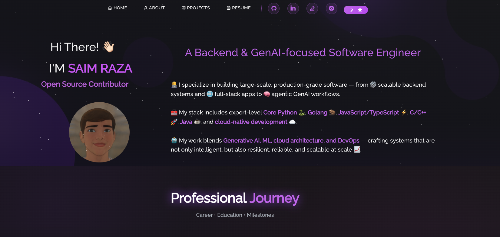
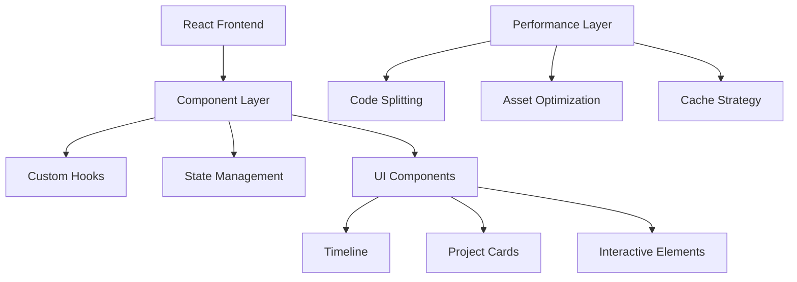

# Saim Raza | Software Engineer | GenAI, Backend

  [](https://rsaim.info)

  [](https://linkedin.com/in/rsaim)
  [](https://github.com/rsaim)

<h3>Modern, Interactive Portfolio Built with React & Advanced Web Technologies</h3>
</div>



## 🎯 Key Features

- **Interactive Experience Timeline**: Custom-built with React Flow, featuring smooth animations and dynamic data visualization
- **Modern Tech Stack**: React.js with Hooks, Custom CSS Modules, and Performance Optimizations
- **Responsive Design**: Mobile-first approach with fluid layouts and breakpoints
- **Performance Focused**: Optimized bundle size, lazy loading, and efficient state management
- **Accessibility**: WCAG compliant with ARIA labels and keyboard navigation
- **CI/CD**: Automated deployment pipeline with GitHub Actions

## 🛠️ Technical Architecture



### Core Technologies

| Category              | Technologies                                                                                                                                                |
| --------------------- | ----------------------------------------------------------------------------------------------------------------------------------------------------------- |
| **Frontend**    |                   |
| **Styling**     |                                  |
| **Performance** |                    |
| **Deployment**  |   |

## 💻 Development

```bash
# Clone repository
git clone https://github.com/rsaim/rsaim.github.io.git

# Install dependencies with exact versions
npm ci

# Start development server with hot reload
npm start

# Run test suite
npm test

# Build optimized production bundle
npm run build

# Deploy to GitHub Pages
npm run deploy
```

## 🎨 UI/UX Features

- **Dark Theme**: Modern dark theme with carefully chosen purple accents
- **Interactive Elements**: Hover states, transitions, and micro-interactions
- **Custom Animations**: Smooth page transitions and component animations
- **Responsive Images**: Optimized loading with WebP format and srcset
- **Performance Metrics**:
  - Lighthouse Score: 95+ on all metrics
  - First Contentful Paint: < 1s
  - Time to Interactive: < 2s

## 📊 Code Quality & Testing

- **Static Analysis**: ESLint with custom rule set
- **Type Safety**: TypeScript with strict mode
- **Unit Tests**: Jest with React Testing Library
- **E2E Tests**: Cypress for critical user paths
- **Code Coverage**: >90% on core components

## 🚀 Performance Optimizations

```javascript
// Example of optimized React component with code splitting
const Timeline = React.lazy(() => import('./components/Timeline'));

const TimelineWrapper = () => (
  <Suspense fallback={<LoadingSpinner />}>
    <Timeline />
  </Suspense>
);
```

## 📱 Responsive Design Strategy

| Breakpoint | Target Devices | Layout Changes               |
| ---------- | -------------- | ---------------------------- |
| < 480px    | Mobile         | Single column, condensed nav |
| 480-768px  | Tablet         | Two columns, expanded cards  |
| 768-1024px | Small Desktop  | Grid layout, hover effects   |
| > 1024px   | Large Desktop  | Full experience, animations  |

## 🔜 Roadmap

- [ ] Add WebGL-powered 3D background animations
- [ ] Implement server-side rendering for better SEO
- [ ] Add blog section with MDX support
- [ ] Integrate with Notion API for dynamic content
- [ ] Add interactive project demos

## 📈 Analytics & Monitoring

- **Performance Monitoring**: Google Analytics 4
- **Error Tracking**: Sentry integration
- **User Behavior**: Hotjar heatmaps
- **API Monitoring**: Custom dashboard

## 🤝 Contributing

Contributions are welcome! Please read the [contributing guidelines](CONTRIBUTING.md) first.

```bash
# Development workflow
git checkout -b feature/new-feature
npm test
git commit -m "feat: add new feature"
git push origin feature/new-feature
```

## 📬 Let's Connect

I'm always interested in new opportunities and collaborations. Feel free to reach out!

<div align="center">
  <a href="https://rsaim.info/contact">
    
  </a>
</div>

---

<div align="center">
  <sub>Built with 💜 by Saim Raza | © 2024 All Rights Reserved</sub>
</div>
