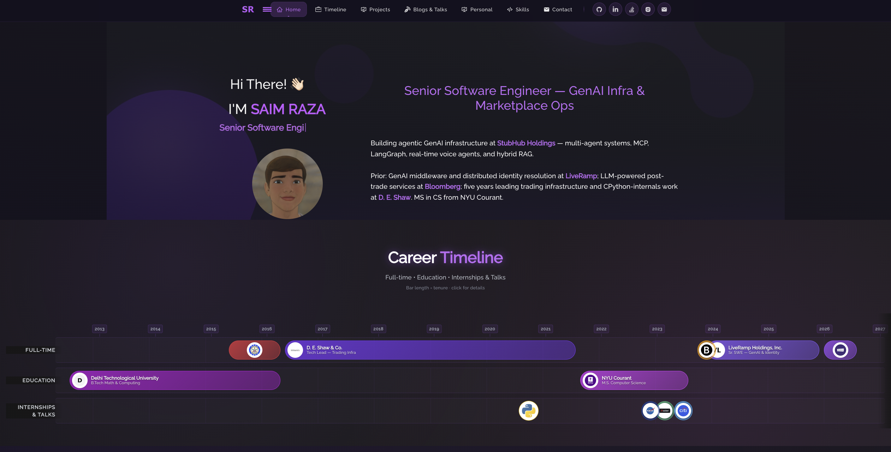

# Portfolio

A React portfolio site — career timeline, project showcase, contact form —
built to be forked and filled in with your own data.



## Run it (no config needed)

```bash
git clone <your fork>
cd portfolio
npm install
npm start
```

That's it — first run auto-creates `data/profile.yaml` and `.env` from
their tracked `*.example.*` templates, so the site comes up at
`http://localhost:3000` with placeholder content out of the box.

## Make it yours

Edit `data/profile.yaml`: your identity, bio, social links, career
timeline, and projects. Restart `npm start` to see changes.

`data/profile.yaml` is git-ignored — your real data never gets committed.
`data/profile.schema.json` drives autocomplete/validation for it in editors
(VS Code: install the
[YAML extension](https://marketplace.visualstudio.com/items?itemName=redhat.vscode-yaml),
already included in the devcontainer).

Adding your own images (avatar, timeline logos, project screenshots)? Wire
them into `src/config/assetMap.js`, which maps the `logoKey`/`imgKey`/
`avatarKey` values in `profile.yaml` to bundled files under `src/Assets/`.

Want a working contact form? See `CONTACT_IMPLEMENTATION_GUIDE.md` for
EmailJS setup — it's optional, the form just shows a "not configured"
message without it.

## Deploying

Deploys via GitHub Actions (`.github/workflows/deploy.yml`) on every push to
`main` — build, then publish through GitHub Pages' "GitHub Actions" build
source (Settings → Pages → Build and deployment → Source).

Since `data/profile.yaml` and `.env` aren't in git, the workflow needs your
real values as repo secrets (Settings → Secrets and variables → Actions):
`PROFILE_YAML` (full contents of your `data/profile.yaml`),
`REACT_APP_SITE_TITLE`, `REACT_APP_SITE_DESCRIPTION`, `REACT_APP_SITE_URL`,
`REACT_APP_CF_BEACON_TOKEN` (optional — see below), and — if you set up the
contact form — the three `REACT_APP_EMAILJS_*` values from
`CONTACT_IMPLEMENTATION_GUIDE.md`.

If you're using a different domain, update `homepage` in `package.json`, the
root `CNAME` file, `public/sitemap.xml`, and the `Sitemap:` line in
`public/robots.txt`.

## SEO & analytics

- `public/index.html`'s title/description/canonical/OG/Twitter tags are all
  driven by `REACT_APP_SITE_TITLE`/`_DESCRIPTION`/`_URL` in `.env` — no
  per-fork edits to `index.html` needed. `public/og-image.png` is the social
  preview image; swap it for your own.
- A schema.org `Person` block (name, tagline, social links) is injected at
  runtime from `profile.yaml` — see `src/components/StructuredData.js`.
- `public/404.html` redirects direct hits on React Router routes (e.g.
  `/project`) back into the app — GitHub Pages has no server-side router of
  its own, so without it those URLs 404 instead of loading the SPA.
- Traffic is tracked via [Cloudflare Web Analytics](https://www.cloudflare.com/web-analytics/)
  (cookieless, no consent banner needed) — set `REACT_APP_CF_BEACON_TOKEN`
  to enable it, or leave it blank to disable.

## Local development

```bash
npm install
npm start         # dev server, hot reload
npm test
npm run build     # production build
```

## Features

- **Career timeline**: CSS-grid Gantt on desktop (bar length = tenure,
  across Full-time / Education / Internships lanes), chronological vertical
  layout on mobile.
- **Project showcase**: grouped sections, cards with
  title/description/tech-stack/link.
- **Contact form**: EmailJS-powered, no backend required.
- **Responsive**: mobile-first.

Built with React 17 (Create React App), React Bootstrap, tsParticles,
react-icons, typewriter-effect.

## How it works, in more detail

- `data/profile.yaml` is the single source of truth for content, but
  component code doesn't import it directly — Create React App blocks
  imports from outside `src/` and has no YAML loader. Instead,
  `scripts/ensure-local-config.js` runs on every `prestart`/`prebuild`/
  `pretest`, parses the YAML, and writes the equivalent JSON to
  `src/config/profile.json` — a derived, git-ignored file the app actually
  imports. Don't hand-edit `profile.json`; edit `profile.yaml` and restart.
- That same script also creates `data/profile.yaml`/`.env` from their
  tracked `*.example.*` templates on first run, but only if they don't
  already exist — it never overwrites real data.
- `data/profile.schema.json` (JSON Schema draft-07) documents the full data
  shape and is referenced from both YAML files via a
  `# yaml-language-server: $schema=...` modeline.

## Project structure

```
data/
  profile.yaml               git-ignored, real data — edit this
  profile.example.yaml       tracked template
  profile.schema.json        schema for both, drives editor validation

src/
  config/
    profile.json              auto-generated, git-ignored (don't edit)
    assetMap.js                image key -> bundled asset wiring
  components/                  Home, Navbar, Footer, Projects, Contact, etc.
  Assets/                       images referenced via assetMap.js

.github/workflows/deploy.yml   build + deploy to GitHub Pages
public/                        static HTML template, favicon, manifest
```
