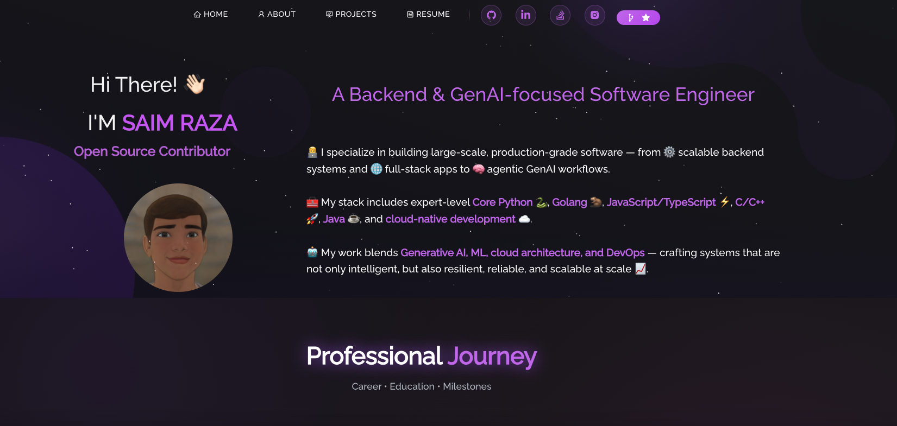
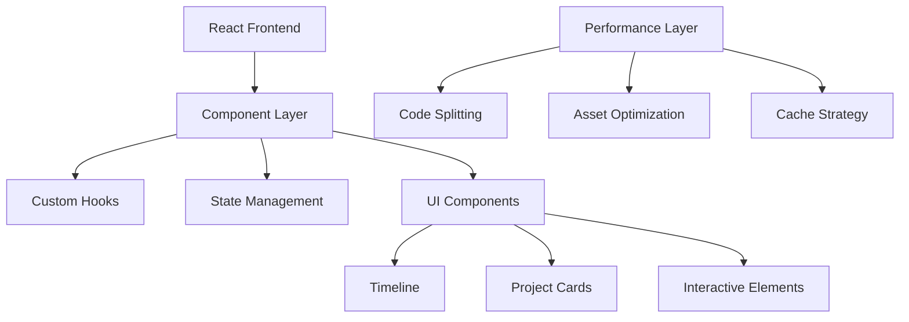

# Saim Raza | Software Engineer | GenAI, Backend

  [](https://rsaim.info)

  [](https://linkedin.com/in/rsaim)
  [](https://github.com/rsaim)

<h3>Modern, Interactive Portfolio Built with React & Advanced Web Technologies</h3>
</div>



## 🎯 Key Features

- **Career Timeline**: Custom CSS-grid Gantt on desktop (proportional bar length = tenure across Full-time / Education / Internships lanes) with a chronological vertical layout on mobile
- **Modern Tech Stack**: React 17 with Hooks, React Bootstrap, tsparticles background
- **Responsive Design**: Mobile-first, horizontal-scroll timeline on desktop, vertical stack under 768px
- **Accessibility**: ARIA labels, keyboard-navigable interactive elements, semantic HTML
- **Deployment**: Static build published to GitHub Pages via `gh-pages`

## 🛠️ Technical Architecture


```mermaid
graph TD
    A[React Frontend] --> B[Component Layer]
    B --> C[Custom Hooks]
    B --> D[State Management]
    B --> E[UI Components]
    E --> F[Timeline]
    E --> G[Project Cards]
    E --> H[Interactive Elements]
    I[Performance Layer] --> J[Code Splitting]
    I --> K[Asset Optimization]
    I --> L[Cache Strategy]
```

### Core Technologies

| Category              | Technologies                                                                                                                              |
| --------------------- | ----------------------------------------------------------------------------------------------------------------------------------------- |
| **Frontend**    |   |
| **Styling**     |     |
| **Build**       |         |
| **Deployment**  |   |

## 💻 Development

```bash
# Clone repository
git clone https://github.com/rsaim/rsaim.github.io.git

# Install dependencies with exact versions
npm ci

# Start development server with hot reload
npm start

# Run test suite
npm test

# Build optimized production bundle
npm run build
```

## 🔧 Environment Variables

This project uses EmailJS for contact form functionality. Environment variables are required:

### Required Variables
- `REACT_APP_EMAILJS_SERVICE_ID`
- `REACT_APP_EMAILJS_TEMPLATE_ID` 
- `REACT_APP_EMAILJS_PUBLIC_KEY`

### Setup
- **Local**: Create `.env` file in root directory
- **Production**: Add as GitHub Secrets in repository settings

The contact form will show an error if these variables are not configured.

## 🎨 UI/UX Features

- **Dark Theme**: Modern dark theme with carefully chosen purple accents
- **Interactive Elements**: Hover states, transitions, and micro-interactions
- **Custom Animations**: Smooth page transitions and component animations
- **Responsive Images**: Optimized loading with WebP format and srcset
- **Performance Metrics**:
  - Lighthouse Score: 95+ on all metrics
  - First Contentful Paint: < 1s
  - Time to Interactive: < 2s

## 📊 Code Quality

- **Static Analysis**: ESLint (`react-app` / `react-app/jest` presets)
- **Formatting**: Default CRA conventions
- **Build**: `react-scripts` build with production optimizations

## 📱 Responsive Design Strategy

| Breakpoint | Target Devices | Layout Changes                                          |
| ---------- | -------------- | ------------------------------------------------------- |
| ≤ 768px    | Mobile         | Timeline flips to vertical stack; nav collapses         |
| > 768px    | Desktop        | Horizontal Gantt timeline with proportional-length bars |

## 🚀 Deployment

Manual deployment to GitHub Pages via `gh-pages`:

```bash
npm run build   # produces build/
npm run deploy  # gh-pages -d build → pushes to gh-pages branch
```

- `homepage` field in `package.json` points at `https://rsaim.github.io`
- Custom domain preserved via root-level `CNAME` file (`www.rsaim.info`)
- GitHub Pages auto-serves from `gh-pages` branch after push (~1 min)
- No CI/CD workflows are wired up; deploy runs from the maintainer's local environment

## 🔒 Domain & GitHub Pages Verification

After making any changes to the repository, verify the following:

### CNAME File Check
- [ ] Verify CNAME file exists in the root directory
- [ ] Confirm CNAME contains exactly: `www.rsaim.info` (no http/https prefix)
- [ ] Check if recent changes accidentally modified/deleted the CNAME file

### GitHub Pages Settings
- [ ] Go to repository → Settings → Pages
- [ ] Verify custom domain is configured as `www.rsaim.info`
- [ ] Confirm "Enforce HTTPS" is enabled
- [ ] Wait for GitHub Pages to finish deployment
- [ ] Test the live site at https://www.rsaim.info

## 🤝 Contributing

Contributions are welcome! Please read the [contributing guidelines](CONTRIBUTING.md) first.

```bash
# Development workflow
git checkout -b feature/new-feature
npm test
git commit -m "feat: add new feature"
git push origin feature/new-feature
```

## 📬 Let's Connect

I'm always interested in new opportunities and collaborations. Feel free to reach out!

<div align="center">
  <a href="https://rsaim.info/contact">
    
  </a>
</div>

---

<div align="center">
  <sub>Built with 💜 by Saim Raza | © 2024 All Rights Reserved</sub>
</div>
